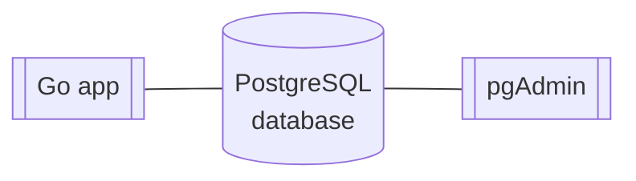

# "Rotina de transações"

## What is this project?

A REST API which provides resources to manage Accounts and it's Transactions.

## What this project contains?



The project is build with 3 blocks:

- A Go application which acts as a HTTP server, exposing a public API.
- A PostgreSQL database.
- A PostgreSQL GUI (optional, available at [http://0.0.0.0:5050](http://0.0.0.0:5050)).

## Read This First

In order to execute this project on your local machine, make sure you have the following requirements installed and
working properly before proceed:

- [Docker](https://www.docker.com/): version `Docker version 20.10.21, build 20.10.21-0ubuntu1~20.04.2` or above.
- [Docker Compose](https://docs.docker.com/compose/): version: `docker-compose version 1.25.0, build unknown` or above.
- [GNU Make](https://www.gnu.org/software/make/): version `GNU Make 4.2.1` or above.

**Obs**: the versions are suggested. The project may (or may not) work properly with older versions.

## How to Run

1. Clone this repository in your local machine.
2. Navigate to the root directory.
3. Using a terminal windown, execute the following command:

```
make run
```

In a few seconds, the app will be up and running with a fresh environment at [http://0.0.0.0:8080](http://0.0.0.0:8080)
:wink:

## How to run tests?

1. Navigate to the root directory.
2. Using a terminal windown, execute the following command:

```
make tests
```

## How to stop it?

1. Navigate to the root directory.
2. Using a terminal windown, execute the following command:

```
make destroy-env
```

## API Endpoints

### `POST /accounts`

Creates a new Account.

#### Request Example

Using cURL:

```
curl -i -X POST http://0.0.0.0:8080/accounts -H 'Content-Type:application/json' -d '{"document":"12345678"}'
```

#### Expected Response

```
HTTP/1.1 201 Created
Content-Type: application/json
Server: transactions-api
Date: Thu, 25 May 2023 04:07:19 GMT
Content-Length: 0
```

### `GET /accounts/:accountId`

Retrieve data from an Account linked to the given `accountId`.

#### Request Example

Using cURL:

```
curl -i -X GET http://0.0.0.0:8080/accounts/1
```

#### Expected Response

```
HTTP/1.1 200 OK
Content-Type: application/json
Server: transactions-api
Date: Thu, 25 May 2023 04:10:15 GMT
Content-Length: 30

{"id":1,"document":"12345678"}
```

### `POST /transactions`

Creates a new Transaction from a given Account.

#### Request Example

Using cURL:

```
curl -i -X POST http://0.0.0.0:8080/transactions -H 'Content-Type:application/json' -d '{"account_id":1, "operation_id":1, "amount":100.1}'
```

#### Expected Response

```
HTTP/1.1 201 Created
Content-Type: application/json
Server: transactions-api
Date: Thu, 25 May 2023 04:12:11 GMT
Content-Length: 0
```

## What is Next?

Please check the [notes](/notes.md) file to read extra notes I've made considering what could be the next steps for such
project.
